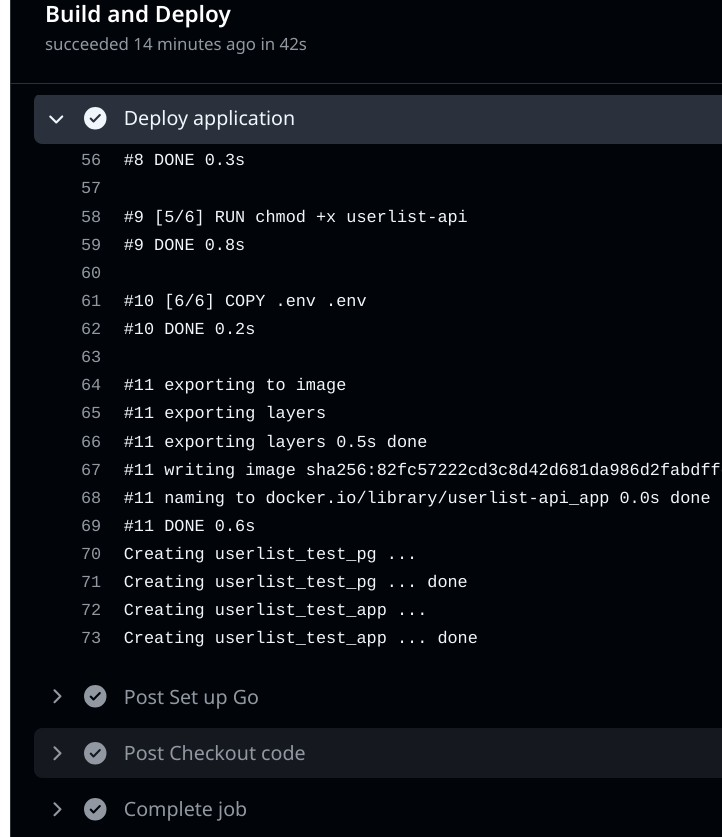
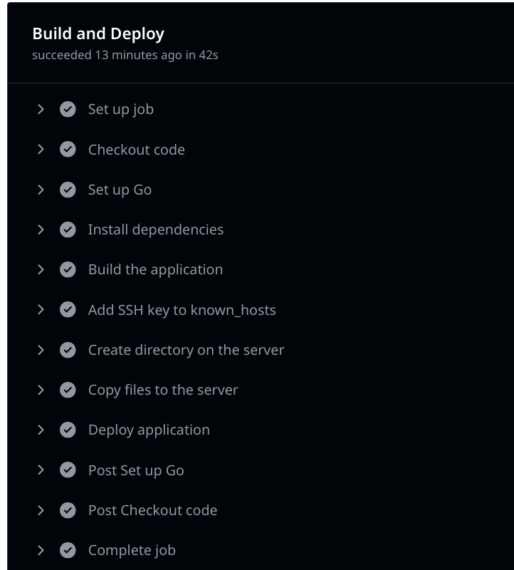
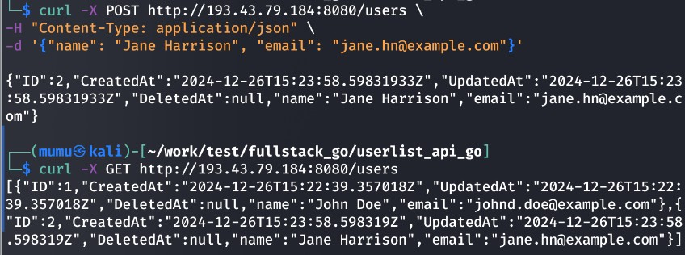

# Тестовое задание
## Часть 1: Серверная часть на Go (Backend)  
### 1. Разработка API    

Ссылка на репозиторий с приложением:
https://github.com/Egori/userlist-api-go-test
Использовано ORM Gorm, для миграции задействовано Gorm AutoMigrate.
Написаны тесты для методов сервисного слоя, с мокированием репозитория, а также для тестов с подключением тестовой БД.

### 2. Оптимизация производительности

 Оптимизация производительности API для работы с большим объемом данных требует всестороннего подхода, включающего оптимизацию базы данных, кода и инфраструктуры.
####  Оптимизация базы данных
##### Индексация
Необходимо создать индексы в базе данных на колонки, используемые в фильтрации и сортировке, такие как ID, name, Email. Например:
```sql
CREATE INDEX idx_name ON users (name);  
CREATE INDEX idx_email ON users (email);  
CREATE INDEX idx_id ON users (id);  
```
Если используется Gorm,как в нашем случае, индексы прописываются в структуре модели:
```go
type User struct {
	gorm.Model
	Name  string `json:"name" gorm:"size:100;not null;index"`
	Email string `json:"email" gorm:"size:255;not null;unique"`
}
```

При этом индексы будут созданы автоматически в базе данных при создании таблицы.
```go
    db.AutoMigrate(&User{})
```

##### Шардирование
При огромных объемах данных (>10 млн записей) можно рассмотреть горизонтальное шардирование, например, по возрасту или географическому региону.

#### Оптимизация приложения
##### Пагинация
Вместо возврата всех записей в ответе, потребуется реализовать пагинацию. Например:
```go
func (r *userRepository) GetPaginated(limit, offset int) ([]models.User, error) {
    var users []models.User
    err := r.db.Limit(limit).Offset(offset).Find(&users).Error
    return users, err
}
```
##### Кэширование
Кэширование часто запрашиваемых данных в Redis или Memcached поможет ускорить доступ к данным и уменьшить нагрузку на базу данных.

##### Batch Updates
выполнение операций с большим объемом данных производится партиями:
for _, user := range users {
    db.Model(&user).Updates(map[string]interface{}{"age": 30})
}

#####  Сжатие данных
Cжатие HTTP-ответов через middleware, например, gzip:
```go
import	"github.com/labstack/echo/v4/middleware"

	e := echo.New()

	// Добавляем middleware для сжатия
	e.Use(middleware.CompressWithConfig(middleware.CompressConfig{
		Level: middleware.DefaultCompressionLevel, // Уровень сжатия
	}))
  ```
  
  #### Инфраструктура
##### Вертикальное масштабирование
Обеспечить достаточное количество ресурсов ссервера (RAM, CPU).
##### Горизонтальное масштабирование и балансировка нагрузки баз данных.
Создать реплики базы данных для распределения нагрузки на чтение.
Балансировка нагрузки с репликами может быть реализована:  
 - В приложении (самостоятельное распределение запросов).
 - Через прокси (ProxySQL, Pgpool-II).
 - На уровне драйвера базы данных.
##### Балансировка нагрузки
Использовать Load Balancer (например, настроив Nginx) для распределения запросов между несколькими экземплярами API.

## Часть 2: Работа с PostgreSQL  
### 3. Проектирование базы данных

#### Таблица `users` (Пользователи)
Хранит информацию о пользователях.  

| Поле           | Тип данных          | Описание                                |
|----------------|---------------------|----------------------------------------|
| `id`          | SERIAL PRIMARY KEY  | Уникальный идентификатор пользователя  |
| `name`        | VARCHAR(255)        | Имя пользователя                       |
| `email`       | VARCHAR(255) UNIQUE | Email пользователя                     |
| `created_at`  | TIMESTAMP DEFAULT CURRENT_TIMESTAMP | Дата регистрации |

#### Таблица `products` (Товары)
Хранит информацию о товарах.  

| Поле           | Тип данных          | Описание                                |
|----------------|---------------------|----------------------------------------|
| `id`          | SERIAL PRIMARY KEY  | Уникальный идентификатор товара        |
| `name`        | VARCHAR(255)        | Название товара                        |
| `price`       | DECIMAL(10, 2)      | Цена товара                            |
| `stock`       | INTEGER             | Количество на складе                   |
| `created_at`  | TIMESTAMP DEFAULT CURRENT_TIMESTAMP | Дата добавления товара |

#### Таблица `orders` (Заказы)
Хранит информацию о заказах пользователей.  

| Поле           | Тип данных          | Описание                                |
|----------------|---------------------|----------------------------------------|
| `id`          | SERIAL PRIMARY KEY  | Уникальный идентификатор заказа        |
| `user_id`     | INTEGER             | Внешний ключ на `users.id`             |
| `total`       | DECIMAL(10, 2)      | Общая сумма заказа                     |
| `created_at`  | TIMESTAMP DEFAULT CURRENT_TIMESTAMP | Дата создания заказа |
| FOREIGN KEY   |                     | (`user_id`) REFERENCES `users`(`id`) ON DELETE CASCADE |

#### Таблица `order_items` (Элементы заказа)
Связывает заказы с товарами.  

| Поле           | Тип данных          | Описание                                |
|----------------|---------------------|----------------------------------------|
| `id`          | SERIAL PRIMARY KEY  | Уникальный идентификатор записи        |
| `order_id`    | INTEGER             | Внешний ключ на `orders.id`            |
| `product_id`  | INTEGER             | Внешний ключ на `products.id`          |
| `quantity`    | INTEGER             | Количество товара                      |
| `price`       | DECIMAL(10, 2)      | Цена за единицу товара на момент заказа|
| FOREIGN KEY   |                     | (`order_id`) REFERENCES `orders`(`id`) ON DELETE CASCADE |
| FOREIGN KEY   |                     | (`product_id`) REFERENCES `products`(`id`) |

---

### Обеспечение целостности данных

1. **Первичные ключи (`PRIMARY KEY`)**  
   Гарантируют уникальность записей в каждой таблице.

2. **Внешние ключи (`FOREIGN KEY`)**  
   - В таблице `orders` поле `user_id` связано с таблицей `users`.  
   - В таблице `order_items` поля `order_id` и `product_id` связаны с таблицами `orders` и `products` соответственно.  
   - Механизм `ON DELETE CASCADE` удаляет связанные записи автоматически, если пользователь или заказ удаляются.

3. **Ограничения уникальности (`UNIQUE`)**  
   Поле `email` в таблице `users` уникально, чтобы избежать дублирования.

4. **Проверка (`CHECK`)**  
   - Проверки на положительное количество товаров и цен:  
     ```sql
     CHECK (price >= 0), CHECK (quantity > 0), CHECK (stock >= 0)
     ```

5. **Индексы**  
   - Индексы на поля, которые часто используются в фильтрах или JOIN (`user_id`, `product_id`, `product_name`, `order_id`), для ускорения запросов.  

   Пример:
   ```sql
   CREATE INDEX idx_orders_user_id ON orders (user_id);
   CREATE INDEX idx_order_items_product_id ON order_items (product_id);
   ```

6. **Нормализация**  
   - Таблицы спроектированы согласно нормальным формам. Данные о пользователях, товарах и заказах разделены для предотвращения избыточности.


### 4. Оптимизация запросов    
Для оптимизации производительности запроса можно использовать предварительное агрегирование данных в подзапросе.

```sql
WITH max_order_dates AS (
    SELECT 
        user_id,
        MAX(created_at) AS max_date
    FROM orders
    GROUP BY user_id
)
SELECT 
    u.id AS user_id,
    u.name AS user_name,
    u.email,
    o.id AS order_id,
    o.total AS order_total,
    o.created_at AS order_date
FROM users u
LEFT JOIN max_order_dates md
    ON u.id = md.user_id
LEFT JOIN orders o
    ON md.user_id = o.user_id
    AND md.max_date = o.created_at
ORDER BY u.id;
```

В подзапросе заранее агрегируются максимальные даты заказов для каждого пользователя, что уменьшает количество вычислений при выполнении основного запроса. Это ускоряет `LEFT JOIN`, так как фильтрация происходит на меньшем объеме данных.

 **Индексация**  
   - На таблице `orders`:
     ```sql
     CREATE INDEX idx_orders_user_id_created_at ON orders (user_id, created_at DESC);
     ```
     Этот индекс ускоряет как группировку, так и фильтрацию по максимальной дате.
   - На таблице `users`:
     ```sql
     CREATE INDEX idx_users_id ON users (id);
     ```
     Обычно создается автоматически как PRIMARY KEY.

---


## Часть 3: Контейнеризация с Docker  
### 5. Создание контейнера для приложения   
   Напишите Dockerfile для вашего Go-приложения.
    Убедитесь, что приложение будет работать в контейнере с минимальными зависимостями. 
   Объясните, как бы вы организовали многоконтейнерную инфраструктуру с использованием Docker Compose (например, для работы с базой данных и веб-сервисом).

Для того, чтобы использовать минимальные зависимости, можно использовать базовый образ alpine. 
При этом нужно собрать приложение вне контейнера.

   **Dockerfile**
   ```Dockerfile
    
      FROM alpine:latest

      # Устанавливаем сертификаты
      RUN apk add --no-cache ca-certificates

      # Устанавливаем рабочую директорию
      WORKDIR /app

      # Копируем скомпилированный бинарный файл
      COPY userlist-api .

      RUN chmod +x userlist-api

      # Копируем переменные окружения
      COPY .env .env

      # Открываем порт
      EXPOSE 8080

      # Запуск приложения
      CMD ["/app/userlist-api"]

```

Файл `docker-compose.yml` для работы с базой данных:
```yaml
version: "3.9"
services:
  postgres:
    image: postgres:17
    container_name: userlist_test_pg
    environment:
      POSTGRES_USER: ${POSTGRES_USER}
      POSTGRES_PASSWORD: ${POSTGRES_PASSWORD}
      POSTGRES_DB: ${POSTGRES_DB}
    ports:
      - "5433:${POSTGRES_PORT}"
    volumes:
      - postgres_data:/var/lib/postgresql/data

  app:
    env_file:
      - .env
    build:
      context: .
      dockerfile: Dockerfile
    container_name: userlist_test_app
    environment:
      - POSTGRES_USER=${POSTGRES_USER}
      - POSTGRES_PASSWORD=${POSTGRES_PASSWORD}
      - POSTGRES_DB=${POSTGRES_DB}
      - POSTGRES_HOST=postgres
      - POSTGRES_PORT=${POSTGRES_PORT}
    ports:
      - "${HTTP_PORT}:${HTTP_PORT}"
    depends_on:
      - postgres

networks:
  default:
    ipam:
      driver: default
      config:
        - subnet: "172.28.0.0/16"

volumes:
  postgres_data:

```

Создаются два контейнера, приложение и база данных. Приложение зависит от базы данных, поэтому оно запускается после базы данных.

###6. Автоматизация CI/CD    
Конфигурация для CI/CD GitHub Actions создана в репозитории, ```.github/workflows/ci-cd-test.yml```.
Выполняются тесты, линт, сборка и деплой приложения.

```yaml
name: CI/CD Pipeline

on:
  push:
    branches:
      - main
  pull_request:
    branches:
      - main

jobs:
  lint:
    name: Lint
    runs-on: ubuntu-latest
    steps:
      - name: Checkout code
        uses: actions/checkout@v4

      - name: Set up Go
        uses: actions/setup-go@v5
        with:
          go-version: 1.23.2

      - name: Install dependencies
        run: go mod tidy

      - name: Run golangci-lint
        run: |
          curl -sSfL https://raw.githubusercontent.com/golangci/golangci-lint/master/install.sh | sh -s v1.54.2
          ./bin/golangci-lint run
  
  test:
    name: Test
    runs-on: ubuntu-latest
    steps:
      - name: Checkout code
        uses: actions/checkout@v4

      - name: Set up Go
        uses: actions/setup-go@v5
        with:
          go-version: 1.23.2

      - name: Install dependencies
        run: go mod tidy

      - name: Run tests
        run: go test ./... -v

  build-and-deploy:
    name: Build and Deploy
    runs-on: ubuntu-latest
    steps:
      - name: Checkout code
        uses: actions/checkout@v4
      
      - name: Set up Go
        uses: actions/setup-go@v5
        with:
          go-version: 1.23.2

      - name: Install dependencies
        run: go mod tidy
      
      - name: Build the application
        run:  CGO_ENABLED=0 GOOS=linux GOARCH=amd64 go build -o userlist-api ./cmd/app

      - name: Add SSH key to known_hosts
        run: |
          mkdir -p ~/.ssh
          ssh-keyscan -H ${{ secrets.TEST_SERVER }} >> ~/.ssh/known_hosts
          chmod 600 ~/.ssh/known_hosts

      - name: Create directory on the server
        env:
          TEST_SERVER: ${{ secrets.TEST_SERVER }}
          SSH_PRIVATE_KEY: ${{ secrets.SSH_PRIVATE_KEY }}
        run: |
          echo "${{ secrets.SSH_PRIVATE_KEY }}" > ssh_key
          chmod 600 ssh_key
          # Создаём директорию на сервере
          ssh -i ssh_key test@${{ secrets.TEST_SERVER }} "mkdir -p /home/test/userlist-api"

      - name: Copy files to the server
        env:
          TEST_SERVER: ${{ secrets.TEST_SERVER }}
          SSH_PRIVATE_KEY: ${{ secrets.SSH_PRIVATE_KEY }}
        run: |
          echo "${{ secrets.SSH_PRIVATE_KEY }}" > ssh_key
          chmod 600 ssh_key
          cd $GITHUB_WORKSPACE  # Переход в корневую директорию репозитория
          # Копируем файлы на сервер
          scp -i ssh_key userlist-api test@${{ secrets.TEST_SERVER }}:/home/test/userlist-api
          scp -i ssh_key .env test@${{ secrets.TEST_SERVER }}:/home/test/userlist-api
          scp -i ssh_key Dockerfile test@${{ secrets.TEST_SERVER }}:/home/test/userlist-api
          scp -i ssh_key docker-compose.yml test@${{ secrets.TEST_SERVER }}:/home/test/userlist-api

      - name: Deploy application
        env:
          TEST_SERVER: ${{ secrets.TEST_SERVER }}
          SSH_PRIVATE_KEY: ${{ secrets.SSH_PRIVATE_KEY }}
        run: |
          ssh -i ssh_key test@${{ secrets.TEST_SERVER }} << 'EOF'
            cd /home/test/userlist-api
            docker-compose down || true
            docker-compose up -d --build
          EOF

```

Приложение успешно собирается и деплоится на сервер:
  
  
  